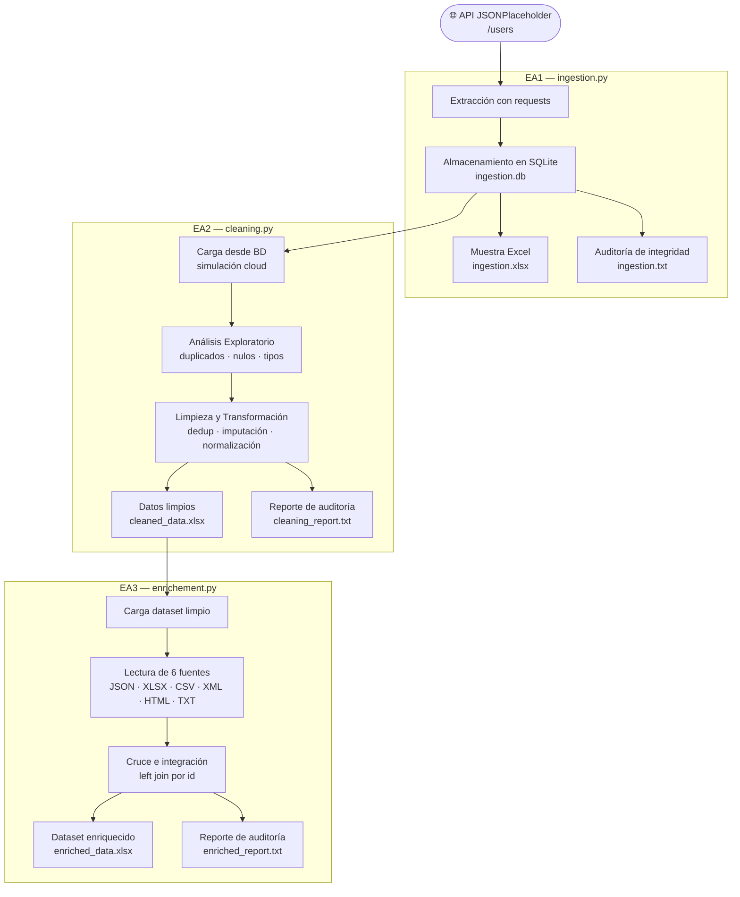

# Proyecto Integrador Big Data – EA1 + EA2 + EA3

Repositorio del proyecto integrador de **Infraestructura y Arquitectura para Big Data**.

## Proceso completo



## Actividades

| Actividad | Descripción | Script | Documentación detallada |
|:--|:--|:--|:--|
| **EA1** | Ingestión de Datos desde un API | `src/ingestion.py` | [📄 EA1\_Ingestion.md](docs/EA1_Ingestion.md) |
| **EA2** | Preprocesamiento y Limpieza de Datos | `src/cleaning.py` | [📄 EA2\_Cleaning.md](docs/EA2_Cleaning.md) |
| **EA3** | Enriquecimiento de Datos | `src/enrichement.py` | [📄 EA3\_Enrichment.md](docs/EA3_Enrichment.md) |

---

## Pipeline general

```
API (JSONPlaceholder /users)
       ↓  EA1 — ingestion.py
  SQLite DB  →  ingestion.xlsx  →  ingestion.txt
       ↓  EA2 — cleaning.py
 DataFrame limpio  →  cleaned_data.xlsx  →  cleaning_report.txt
       ↓  EA3 — enrichement.py
 6 fuentes (JSON, XLSX, CSV, XML, HTML, TXT)
       ↓  merge (left join por id)
 Dataset enriquecido  →  enriched_data.xlsx  →  enriched_report.txt
```

---

## Ejecución local

```bash
# Instalar dependencias
pip install requests pandas openpyxl lxml

# EA1: Ingesta de datos
python src/ingestion.py

# EA2: Preprocesamiento y limpieza
python src/cleaning.py

# EA3: Enriquecimiento de datos
python src/enrichement.py
```

---

## GitHub Actions

El workflow `.github/workflows/bigdata.yml` ejecuta las tres etapas automáticamente en cada `push` a `main`, por cron diario y manualmente desde la interfaz de GitHub.

Los artefactos son descargables desde **Actions → [ejecución reciente] → Artifacts**:
- **`evidencias-ingestion`** — `ingestion.db`, `ingestion.xlsx`, `ingestion.txt`
- **`evidencias-cleaning`** — `cleaned_data.xlsx`, `cleaning_report.txt`
- **`evidencias-enrichment`** — `enriched_data.xlsx`, `enriched_report.txt`

---

## Estructura del proyecto

```
├── README.md
├── docs/
│   ├── EA1_Ingestion.md
│   ├── EA2_Cleaning.md
│   └── EA3_Enrichment.md
├── .github/workflows/bigdata.yml
├── setup.py
└── src/
    ├── ingestion.py
    ├── cleaning.py
    ├── enrichement.py
    ├── data/
    │   ├── departments.json
    │   ├── salaries.xlsx
    │   ├── locations.csv
    │   ├── skills.xml
    │   ├── projects.html
    │   └── notes.txt
    ├── db/ingestion.db
    ├── xlsx/
    │   ├── ingestion.xlsx
    │   ├── cleaned_data.xlsx
    │   └── enriched_data.xlsx
    └── static/auditoria/
        ├── ingestion.txt
        ├── cleaning_report.txt
        └── enriched_report.txt
```
